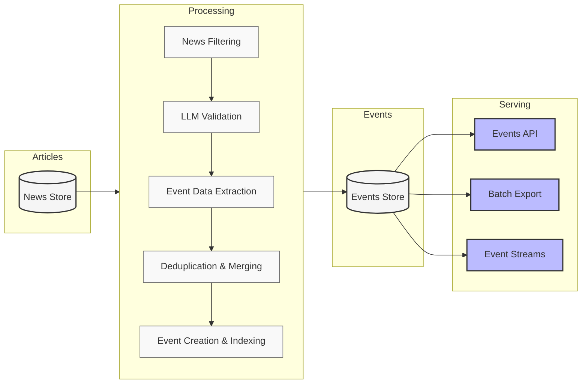

Events Intelligence provides an end-to-end pipeline for extracting structured
event data from news articles. It processes news content through specialized
filtering, validation, and extraction stages to produce standardized event
records. The system supports public events for all users and custom events
implemented for specific business needs.

## System overview

Our Events Intelligence system consists of four main components:



### News store

The foundation of our system is a comprehensive collection of structured news
articles in JSON format dating back to 2019. Each article has undergone
extensive cleaning, enrichment, and modeling to ensure high quality and
searchability. This carefully curated repository represents our core product,
providing rich contextual information and standardized content.

### Processing pipeline

The pipeline transforms news data into structured events through several
specialized stages:

1. **News Filtering**: Identifies potentially relevant articles using
   specialized queries tailored to each event type.

2. **LLM Validation**: Employs state-of-the-art language models (like GPT-4o) to
   validate that filtered articles represent tracked events.

3. **Event Data Extraction**: Employs specialized AI models to extract
   structured event information. These models are fine-tuned for specific event
   types using carefully curated datasets.

4. **Deduplication & Merging**: Maintains data consistency by identifying and
   combining related event mentions while preserving unique details.

5. **Event Creation & Indexing**: Standardizes processed events according to
   defined schemas and indexes them for efficient retrieval.

### Events store

A centralized repository for all structured event data. By default, it contains
events extracted from articles published in the last 30 days. While historical
event extraction (2019-present) is available upon request, it incurs additional
costs. Once an event type is implemented, all newly collected articles are
automatically processed for relevant events.

### Serving layer

Processed event data is available through multiple channels:

- **Events API**: The primary access method, providing RESTful endpoints for
  querying and retrieving event data
- **Batch Export**: Enables bulk extraction for large-scale analysis
- **Event Streams**: Offers real-time access to newly processed events

## Events API

The Events API is a RESTful API that provides access to structured event data
extracted from news articles. It lets you retrieve and analyze specific business
events, such as corporate activities, market changes, and business developments.

### Base URL

You must send all API requests to the following base URL:

```bash
https://events.newscatcherapi.xyz
```

### Endpoints

| Endpoint                            | Method   | Description                               | Use Case                                       |
| ----------------------------------- | -------- | ----------------------------------------- | ---------------------------------------------- |
| `/api/events_info/get_event_fields` | GET      | Get event fields for specified event type | Discover searchable fields for each event type |
| `/api/events_search`                | POST     | Search for events                         | Find events matching specific criteria         |
| `/api/health`                       | GET      | Check API health status                   | Monitor API availability                       |
| `/api/subscription`                 | GET/POST | Get subscription plan details             | Check available events and usage limits        |

### Request format

Include your API key in the `x-api-token` header for each request. All requests
must use HTTPS.

<CodeGroup>

```python Python
import requests
import json

API_KEY = "YOUR_API_KEY"
URL = "https://events.newscatcherapi.xyz/api/events_search"
HEADERS = {"x-api-token": API_KEY, "Content-Type": "application/json"}

PAYLOAD = {
    "event_type": "layoff",
    "attach_articles_data": True,
    "additional_filters": {
        "layoff.number_of_people_laid_off": {"gte": 1000},
        "event_date": {"gte": "now-30d", "lte": "now"},
    },
}

try:
    response = requests.post(URL, headers=HEADERS, json=PAYLOAD)
    response.raise_for_status()
    print(json.dumps(response.json(), indent=2))
except requests.exceptions.RequestException as e:
    print(f"Failed to fetch events: {e}")
```

```bash cURL
curl -X POST \
  'https://events.newscatcherapi.xyz/api/events_search' \
  -H 'x-api-token: YOUR_API_KEY' \
  -H 'Content-Type: application/json' \
  -d '{
    "event_type": "layoff",
    "attach_articles_data": true,
    "additional_filters": {
      "layoff.number_of_people_laid_off": {
        "gte": 1000
      },
      "event_date": {
        "gte": "now-30d",
        "lte": "now"
      }
    }
  }'
```

</CodeGroup>

### Response format

All API responses are JSON objects containing events and metadata. For example,
the key response fields for layoff event include:

<ResponseField name="message" type="string" required>
  The status message of the search operation. Example: "Success"
</ResponseField>

<ResponseField name="count" type="integer" required>
  The total number of events returned. Example: 25
</ResponseField>

<ResponseField name="events" type="array" required>
  The list of matched events. Each event contains:

  <Expandable title="Event object">
    <ResponseField name="id" type="string" required>
      The unique identifier of the event.
    </ResponseField>

    <ResponseField name="event_type" type="string" required>
      The specific type of the event.
    </ResponseField>

    <ResponseField name="global_event_type" type="string" required>
      The high-level category of the event.
    </ResponseField>

    <ResponseField name="associated_article_ids" type="array<string>" required>
      The identifiers of news articles associated with this event.
    </ResponseField>

    <ResponseField name="extraction_date" type="string" format="date-time" required>
      The timestamp when the event was extracted from news sources.
    </ResponseField>

    <ResponseField name="event_date" type="string" format="date-time" required>
      The timestamp when the event occurred.
    </ResponseField>

    <ResponseField name="company_name" type="string" required>
      The name of the company involved in the event.
    </ResponseField>

    <ResponseField name="articles" type="array">
      Array of source articles. Only present when `attach_articles_data` is `true`.
    </ResponseField>

    <ResponseField name="layoff" type="object">
      For layoff events, contains the following required fields:

      <Expandable title="Layoff object">
        <ResponseField name="number_of_people_laid_off" type="integer" required>
          The exact number of employees affected.
        </ResponseField>

        <ResponseField name="percentage_of_people_laid_off" type="number" format="float" required>
          The percentage of total workforce affected.
        </ResponseField>

        <ResponseField name="min_number_of_people_laid_off" type="integer" required>
          The minimum number of employees affected if a range was specified.
        </ResponseField>

        <ResponseField name="max_number_of_people_laid_off" type="integer" required>
          The maximum number of employees affected if a range was specified.
        </ResponseField>

        <ResponseField name="is_relevant_for_real_estate" type="boolean" required>
          True if the layoff impacts real estate market; false otherwise.
        </ResponseField>

        <ResponseField name="summary" type="string" required>
          The detailed description of the layoff event.
        </ResponseField>

        <ResponseField name="how_much_related" type="string">
          The relevance rating of the layoff event.
        </ResponseField>

        <ResponseField name="location" type="array">
          The locations where the layoff occurred.

          <Expandable title="Location object">
            <ResponseField name="country" type="string">
              The country where the event occurred.
            </ResponseField>

            <ResponseField name="city" type="string">
              The city where the event occurred.
            </ResponseField>

            <ResponseField name="county" type="string">
              The county where the event occurred.
            </ResponseField>

            <ResponseField name="state" type="string">
              The state where the event occurred.
            </ResponseField>

            <ResponseField name="raw_location" type="string">
              The unparsed location string from the source.
            </ResponseField>
          </Expandable>
        </ResponseField>
      </Expandable>
    </ResponseField>

  </Expandable>
</ResponseField>

## Available events

The system supports two categories of events:

### General events

Events available to all customers:

- [Layoff](/v3/events/event-types/layoff)
- [Data Breach](/v3/events/event-types/data-breach)
- [Fundraising](/v3/events/event-types/fundraising)

### Custom events

Implemented for specific organizational requirements and accessible only through
organization-specific API keys. Each custom implementation involves developing
specialized extraction models and validation rules tailored to specific event
requirements.

## What's next

To start working with the Events API, refer to these technical resources:

- [Quickstart guide](/v3/events/overview/quickstart)
- [Event types and their fields](/v3/events/overview/event-types-and-fields)
- [Events API reference](v3/events/endpoints/event-fields-get)

<Note>For technical support, contact us at support@newscatcherapi.com.</Note>
