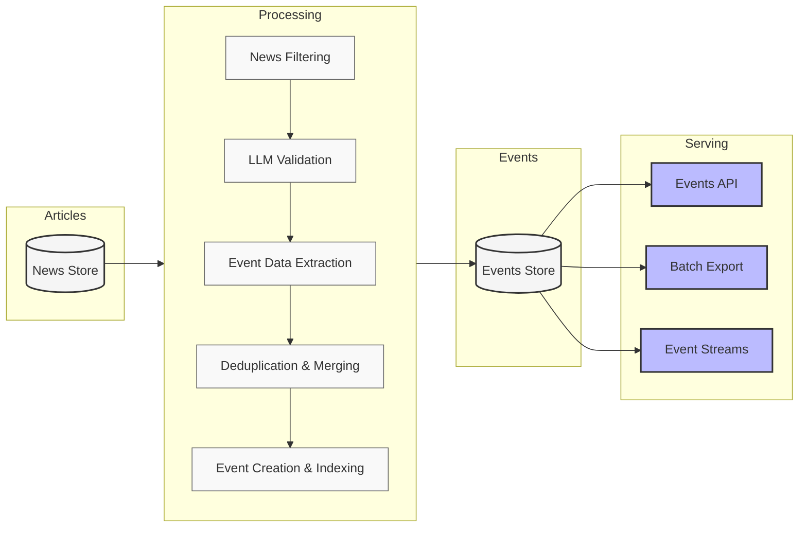

The Events API is a RESTful API that provides access to structured event data
extracted from news articles. It lets you retrieve and analyze specific business
events, such as corporate activities, market changes, and business developments.

## System overview

Our event intelligence system consists of four main components:

### News store

The foundation of our system is a comprehensive collection of structured news
articles in JSON format dating back to 2019. Each article has undergone
extensive cleaning, enrichment, and modeling to ensure high quality and
searchability. This carefully curated repository represents our core product,
providing rich contextual information and standardized content.

### Processing pipeline

The pipeline transforms news data into structured events through several
specialized stages:

1. **News Filtering**: Identifies potentially relevant articles using
   specialized queries tailored to each event type.

2. **LLM Validation**: Employs state-of-the-art language models (like GPT-4o) to
   validate that filtered articles represent tracked events.

3. **Event Data Extraction**: Employs specialized AI models to extract
   structured event information. These models are fine-tuned for specific event
   types using carefully curated datasets.

4. **Deduplication & Merging**: Maintains data consistency by identifying and
   combining related event mentions while preserving unique details.

5. **Event Creation & Indexing**: Standardizes processed events according to
   defined schemas and indexes them for efficient retrieval.

### Events store

A centralized repository for all structured event data. By default, it contains
events extracted from articles published in the last 30 days. While historical
event extraction (2019-present) is available upon request, it incurs additional
costs. Once an event type is implemented, all newly collected articles are
automatically processed for relevant events.

### Serving layer

Processed event data is available through multiple channels:

- **Events API**: The primary access method, providing RESTful endpoints for
  querying and retrieving event data
- **Batch Export**: Enables bulk extraction for large-scale analysis
- **Event Streams**: Offers real-time access to newly processed events

## Available events

The system supports two categories of events:

### General events

Available to all customers:

- Layoff Events
- Data Breach Events
- Fundraising Events

### Custom events

Implemented for specific organizational requirements and accessible only through
organization-specific API keys. Each custom implementation involves developing
specialized extraction models and validation rules tailored to specific event
requirements.

## What's next

To start working with the Events API, refer to these technical resources:

- [Quickstart guide](https://newscatcherapi.com/docs/v3/events/overview/quickstart)
- [Event types and their fields](https://newscatcherapi.com/docs/v3/events/overview/event-types-and-fields)
- [Events API reference](https://newscatcherapi.com/docs/v3/events/endpoints/event-fields-get)

<Note>For technical support, contact us at support@newscatcherapi.com.</Note>
